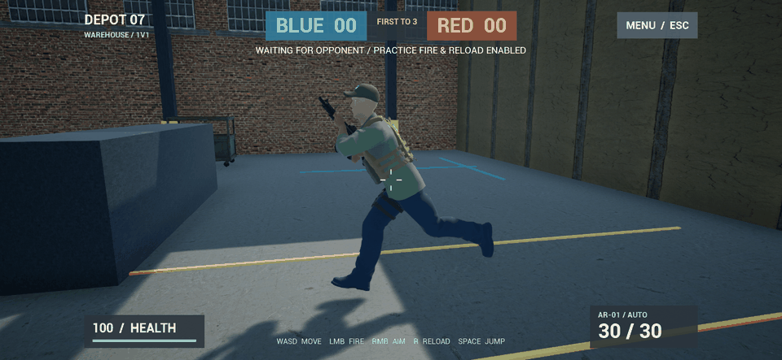

# 持枪与输入优化 v0.4.2

本次处理跑步时一直平举步枪、单人测试左键射击无响应，以及侧移和倒退脚步方向不匹配的问题。此前 v0.4.1 的跑步动画链修复继续保留。

## 新行为

| 状态 | 行为 |
| --- | --- |
| 普通跑步 | 双手把步枪斜收在胸前，枪口朝左上方；减少上身过度前倾 |
| 瞄准 | 抬枪进入瞄准姿势，移动速度降至 120 cm/s |
| 移动中开枪 | 退出收枪姿势，恢复射击方向；服务器继续结算弹药和命中 |
| 换弹 | 退出收枪姿势；枪、双手和弹匣共享同一动画快照，减少错帧 |
| 前进 / 倒退 / 侧移 | 速度上限分别为 375 / 220 / 200 cm/s；倒退反播脚步，侧移通过腿部 IK 调整迈步方向 |
| 等待对手 | 左键可试射，R 可换弹；不结算伤害和击杀；正式开局重新生成满弹药人物 |
| 倒计时、死亡或结束 | 保持武器和对局限制 |
| 菜单 / 恢复游戏 | 菜单点击不会开枪；返回游戏后第一下左键正常射击 |

跑步姿势是程序调整后的现有动作；倒退反播与侧步 IK 也是模板动作的适配，并未导入新的专用持枪动作捕捉包。足底贴地、急停转身等动作还需要进一步完善。

## 操作与复查

先关闭旧游戏窗口，再打开 `D:\TPSDuel\Builds\Windows\WindowsNoEditor\TPSDuel.exe`。创建房间，即使只有一名玩家，也可以验证左键射击和 R 换弹。正式 1v1 需要另一台设备或第二个 PC 客户端加入。

WASD 移动，左键射击，右键瞄准，R 换弹，空格跳跃，Esc 打开 / 关闭菜单。松开左键停止射击。

```powershell
Set-Location D:\TPSDuel
.\tools\TestControls.ps1
.\tools\TestLocomotion.ps1
.\tools\TestNetwork.ps1 -Packaged
```

`TestControls.ps1` 在独立游戏中模拟 Slate 鼠标按下 / 松开，经过视口、输入映射和真实武器逻辑，检查第一次点击、松开停止、菜单点击、恢复后点击、R 换弹、等待阶段无伤害及倒计时禁止开枪。测试不是调用 FirePressed 来代替鼠标事件，也不是硬件鼠标人工验收。

`TestLocomotion.ps1` 用真实移动输入采样 18 个姿势，检查跑步收枪、倒退反播、瞄准减速、开枪抬枪和换弹衔接。双手与枪使用的姿势在骨骼更新完成后同步；日志中的 gripError 测量左手与支撑目标的组件空间距离。



原始截图在 `docs/screenshots/locomotion-v0.4.2`：0–7 前进，8 停下，9 倒退，10 右移，11 左移，12 跳跃，13 瞄准移动，14 再次跑步，15 跑动开枪，16 换弹中段，17 换弹完成。预览由前八张实际截图组成，按日志中的采样间隔生成循环 GIF，不是连续录屏或游戏帧率测量。

## 从源码准备动画

```powershell
.\tools\Build.ps1 -Action Build
.\tools\Build.ps1 -Action Assets
.\tools\Build.ps1 -Action PackageWindows
.\tools\Build.ps1 -Action PackageAndroid
```

按顺序打包，不同时运行两个 UAT。`PrepareCombatAssets.py` 会设置 Q_ThirdPerson_AnimBP 的原生父类 UDuelAnimInstance、连接反向播放速率，再重建持枪姿势链。Quantum 私人资源仍不进入 Git，新电脑需先按资源导入文档准备源文件。

手机更新包在 `Builds/Android/Android_ETC2/TPSDuel-arm64.apk`，归档在 `Builds/Releases/0.4.2/Android`。PC 和手机一起更新后重新建房。手机尚未连接实测，实际结果与文件校验见 `docs/验证报告.md`。
