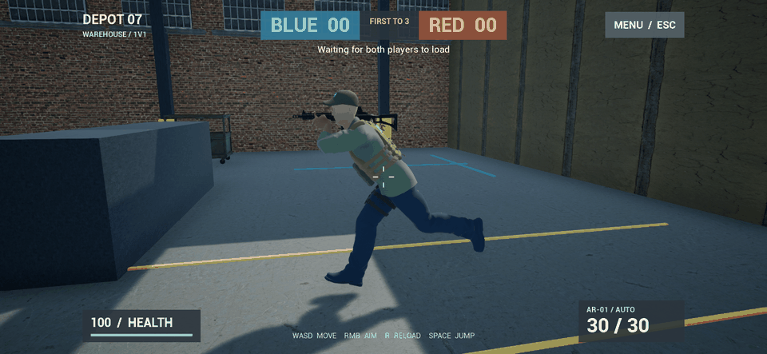

# 跑动动画优化 v0.4.1

本次先修复移动时固定站姿的根因：持枪动画链之前残留了断开的姿势转换节点，跑动动画虽然更新了速度，却没有进入最终人物姿势。资源工具现在重建完整连接，同时保留持枪、瞄准和换弹控制。

跑步最大速度由 500 调整为 375 cm/s，与模板跑步动画样本一致，并调整加速度和刹停。角色仍面向瞄准方向；侧移和倒退目前使用同一套前进动画，需要专用动作进一步提高真实感。

## 打开和测试

PC 打开 `D:\TPSDuel\Builds\Windows\WindowsNoEditor\TPSDuel.exe`，创建房间后按 WASD 移动，空格跳跃，观察脚步和松开按键后的站姿。手机用新版 APK 覆盖安装；PC 和手机都更新后重新建房。

运行连续动作检查：

```powershell
Set-Location D:\TPSDuel
.\tools\TestLocomotion.ps1
```

检查会启动最终 Windows 独立包，输入驱动前进、停下、后退、左右移动及跳跃。脚部采样使用人物组件空间，排除角色平移产生的位移；同时检查动画速度、停下速度和左手持枪误差。真实渲染截图写入 `docs/screenshots/locomotion-v0.4.1`，日志写入 `Saved/locomotion-v041.log`。

截图连续预览使用前八帧，安装了 Pillow 的 Python 可重新生成：

```powershell
python .\tools\MakeLocomotionPreview.py
```



## 从源码重新生成

私人 Quantum 资源不进入 Git；本机已有资源保留在 Content/ThirdParty/Quantum。新电脑仍需按免费资源导入文档先准备源文件。不要只拉取代码便认为这些资源已经存在。

```powershell
.\tools\Build.ps1 -Action Build
.\tools\Build.ps1 -Action Assets
.\tools\Build.ps1 -Action PackageWindows
.\tools\TestLocomotion.ps1
.\tools\TestNetwork.ps1 -Packaged
.\tools\Build.ps1 -Action PackageAndroid
```

同一时间只启动一次 UAT 打包。`Assets` 会调用 PrepareCombatAssets.py，再次保存完整的动画连接。相关诊断保存在 Saved/LocomotionGraph.json；不能仅凭持枪节点已经存在，就认定跑动状态机连通。

实际结果、签名更新校验和当前限制见 `docs/验证报告.md`。
